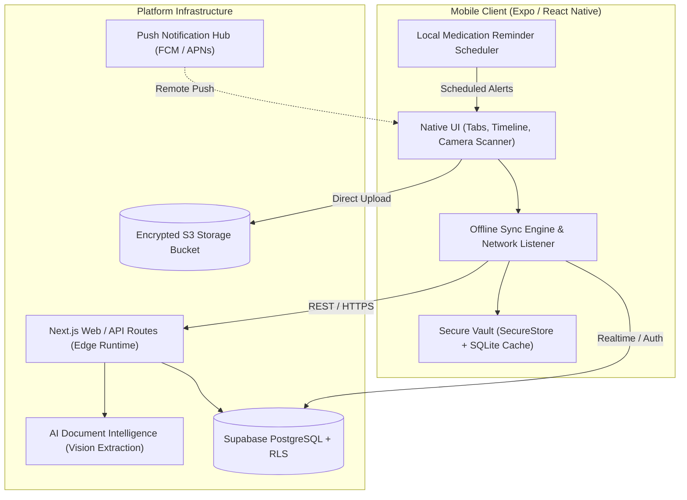

# Medical Timeline — Mobile Architecture Blueprint

Technical specification and architectural design for the cross-platform React Native / Expo application supporting the **Medical Timeline** platform.

---

## 1. System Topology & Integration Architecture



---

## 2. Authentication & Credential Storage

### 2.1 Secure Storage Adapter
Supabase auth tokens (`access_token`, `refresh_token`) cannot be stored in plain `AsyncStorage` due to healthcare privacy requirements. The mobile app implements a custom storage engine using `expo-secure-store`:

```typescript
// lib/supabase.ts
import { createClient } from '@supabase/supabase-js'
import * as SecureStore from 'expo-secure-store'

const ExpoSecureStoreAdapter = {
  getItem: (key: string) => SecureStore.getItemAsync(key),
  setItem: (key: string, value: string) => SecureStore.setItemAsync(key, value),
  removeItem: (key: string) => SecureStore.deleteItemAsync(key),
}

export const supabase = createClient(
  process.env.EXPO_PUBLIC_SUPABASE_URL!,
  process.env.EXPO_PUBLIC_SUPABASE_ANON_KEY!,
  {
    auth: {
      storage: ExpoSecureStoreAdapter,
      autoRefreshToken: true,
      persistSession: true,
      detectSessionInUrl: false,
    },
  }
)
```

### 2.2 Biometric Authentication Lifecycle
1. On app launch, check if biometric hardware is enrolled via `LocalAuthentication.hasHardwareAsync()`.
2. If session token exists in SecureStore, prompt user with FaceID / TouchID / BiometricPrompt before rendering sensitive health screens.
3. Automatically blur and lock the viewport whenever the app is sent to the background (`AppState.addEventListener('change', ...)`).

---

## 3. Document Scanning & Image Pipeline

### 3.1 Capture Pipeline
1. **Camera Viewfinder:** Renders camera with high-resolution still capture mode (`expo-camera`).
2. **Document Edge Guidance:** Displays bounding rectangle guides to assist patients in framing physical paperwork.
3. **Pre-Processing (`expo-image-manipulator`):**
   - Resizes image down to optimal resolution (max width 2048px).
   - Applies high-contrast grayscale filter to optimize optical readability.
   - Compresses JPEG quality to ~0.82 (typically reducing a 6MB raw photo to ~600KB without loss of legibility).
4. **Encrypted Storage Upload:**
   - Uploads file buffer to Supabase Storage bucket `medical-documents` under `${patientId}/${documentId}.jpg`.
   - Generates document record with `processing_status: 'uploaded'`.
5. **Trigger AI Extraction Pipeline:**
   - Calls `POST /api/documents/${documentId}/process` to run structured vision extraction.

---

## 4. Offline Data Architecture & Sync

### 4.1 Local SQLite Cache Schema
To allow emergency offline access to patient records when cellular reception is unavailable in medical facilities, records are mirrored locally in SQLite (`expo-sqlite`):

```sql
CREATE TABLE IF NOT EXISTS cached_timeline_events (
  id TEXT PRIMARY KEY,
  patient_id TEXT NOT NULL,
  event_type TEXT NOT NULL,
  event_date TEXT,
  title TEXT NOT NULL,
  description TEXT,
  is_verified INTEGER,
  cached_at TIMESTAMP DEFAULT CURRENT_TIMESTAMP
);

CREATE TABLE IF NOT EXISTS cached_medications (
  id TEXT PRIMARY KEY,
  patient_id TEXT NOT NULL,
  medicine_name TEXT NOT NULL,
  dosage TEXT,
  frequency TEXT,
  duration TEXT,
  start_date TEXT,
  end_date TEXT,
  cached_at TIMESTAMP DEFAULT CURRENT_TIMESTAMP
);

CREATE TABLE IF NOT EXISTS offline_mutation_queue (
  id INTEGER PRIMARY KEY AUTOINCREMENT,
  endpoint TEXT NOT NULL,
  method TEXT NOT NULL,
  payload TEXT NOT NULL,
  created_at TIMESTAMP DEFAULT CURRENT_TIMESTAMP
);
```

### 4.2 Sync Protocol
- When online: Fetch fresh records from Supabase and write to SQLite with optimistic cache replacement.
- When offline: Serve immediate reads from local SQLite with a prominent "Offline Vault Mode" status banner.
- Offline mutations: Queued in `offline_mutation_queue` and replayed sequentially with backoff retry upon network reconnection (`NetInfo.addEventListener`).

---

## 5. Medication Reminder & Notification Foundation

### 5.1 Local Alarm Scheduling
Medication schedules are critical to adherence. Instead of relying purely on network push notifications, the mobile client schedules local notification triggers directly on the device OS using `expo-notifications`:

```typescript
// lib/notifications.ts
import * as Notifications from 'expo-notifications'

export async function scheduleMedicationDose(
  medName: string,
  dosage: string,
  hour: number,
  minute: number
) {
  return await Notifications.scheduleNotificationAsync({
    content: {
      title: `Medication Reminder: ${medName}`,
      body: `Time to take ${dosage || 'prescribed dose'}. Mark as taken in Medical Timeline.`,
      sound: true,
      priority: Notifications.AndroidNotificationPriority.HIGH,
    },
    trigger: {
      type: Notifications.SchedulableTriggerInputTypes.DAILY,
      hour,
      minute,
    },
  })
}
```

### 5.2 Notification Channels (Android)
- `medication-reminders`: High-importance channel with custom audio and heads-up alert.
- `appointment-alerts`: Default-importance channel for upcoming physician visits.
- `clinical-insights`: Low-importance channel for duplicate test alerts and extraction completion notifications.

---

## 6. Shared Type Contracts

The mobile client consumes the exact TypeScript interface definitions specified in `web/lib/types.ts`:
- `PatientProfile`
- `MedicalDocument`
- `MedicalEvent`
- `Medication`
- `Appointment`
- `FamilyPermission`
- `DoctorAccess`
- `DuplicateTestAlert`
- `InconsistencyAlert`

This ensures 100% type safety and parity between web and mobile interfaces.
